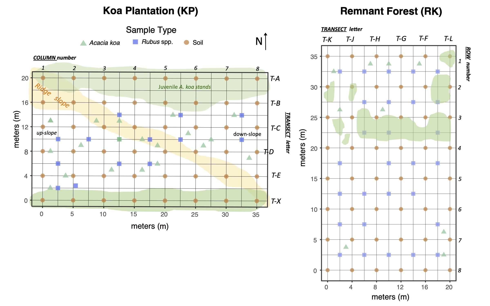

```{r global options, warning=FALSE, message=FALSE}
if (!require('knitr')) install.packages('knitr'); library('knitr')
knitr::opts_chunk$set(warning=FALSE, message=FALSE, fig.align='center')

# Load in packages
if (!require("pacman")) install.packages("pacman"); library(pacman) # for rapid install if not in library

# load packages
pacman::p_load("RgoogleMaps", "SDMTools", "car", "rgdal", "ggmap", "gridExtra", "automap", "cowplot","sp", "gstat", "plotrix", "dplyr", "ggplot2", "scales","magrittr","plyr","effects", "ggpubr", "sjstats", "RColorBrewer", "grid", "ggsn", "sf", "pgirmess","spdep", "ncf", "emmeans")

```

### Background  
**Hakalau National Forest Wildlife Refuge Isoscapes**  
Native Hawaiian montane mesic and wet forests have significantly declined due to over a century of deforestation and extensive human- and livestock-mediated disturbance. Many once native montane forests in Hakalau were converted to pastureland in the 19th century. After a century of deforestation and goat/cattle grazing, parcels have undergone afforestation, restoration, and fencing to keep out ungulates. Afforestation efforts focused on planting 300,000 canopy species - *Acacia koa* (Hawaiian name: *koa*) - in abandoned pasturelands (now, koa plantations, *KP sites*) to jump-start ecosystem succession. However, recovery of these systems remains incomplete.

<center>  
  
{ width=60%}
  
</center>  


We collected samples 20-21 August 2019 in Hakalau Forest, Hawai‘i Island. Plants and soil samples were collected from two areas: the koa plantation (*KP sites*), and a remnant mixed koa-‘ōhi‘a forest (*RK sites*). The canopy species in these forests are engineers of forest habitats are dominated by *Acacia koa*, an indigenous hardwood species that forms native forest canopies and associates with nitrogen fixing bacteria, and a non-N~2~-fixing hardwood species *Metrosiderous polymorpha* (Hawaiian name: *‘ōhi‘a*) Understory species include *Rubus argutus* - an invasive species (common name: sawtooth blackberry) -- and an endemic species *Rubus hawaiiensis* (common name: ‘ākala); both are members of the Roseaceae family. Notably, *R. argutus* was found more in the remnant forest (i.e., RK) and the indigenous *R. hawaiiensis* was common in the koa plantation (i.e, KP). 

<center>  
  
{ width=80%}
  
</center>  

  
Plants samples were collected in a spatially explicit fashion (every 4 or 5m) with a 20 x 35m superplot, consisting of thirty-five 4 x 5m subplots. This data was used to create a δ^13^C and δ^15^N stable isotope landscapes, hereafter 'isoscapes'. Koa and *Rubus* spp. were collected within each 4 x 5m subplot.  *Plot densities were...*   
KP: Koa (18 trees) Rubus (14 plants) per 20 x 35m plot= *257 Koa and 200 Rubus per hectare*  
RK: Koa (10 trees) Rubus (28 plants) per 20 x 35m plot= *142 Koa and 400 Rubus per hectare*  


### Site Maps
```{r, site maps, fig.cap="**Figure 3**. Site map of (**A**) the Hawaiian Archipelago highlighting the location of Hakalau Forest National Wildlife Refuge (red diamond) on the island of Hawai‘i; (**B**) Koa plantation and remnant forest sampling areas (KP, RK); (**C**, **D**) layouts (20 × 35 m), with plot corners in red circles and Acacia koa trees in green triangles", fig.align='center', results='hide'}

# load data
HAK.gps<-read.csv("data/Hakalau.gps.csv")
API<-read.csv("data/API_key.csv")
API.key<-API[1,1]

#quick map
# ggplot(HAK.gps, aes(x = longitude, y = latitude)) + coord_quickmap() + geom_point()

######## using ggmap
register_google(key=API.key)

########
#Hawaiian islands Map
########
hi_map<-get_map(location=c(-157,20.5),zoom=7,maptype="satellite",color="color")
hi_map_for_man <- ggmap(hi_map) +
  geom_point(aes(x = -155.320, y = 19.83), pch=23,colour="black",fill="red", size = 2, stroke=0.5) +
  xlab("") + ylab("Latitude") +
  scale_y_continuous(limits=c(18.8, 22.2))+
  scale_x_continuous(limits=c(-160.2, -154)) +
  theme(axis.text=element_text(colour="black",size=5),
        axis.title=element_text(colour="black",size=8),
        plot.margin = unit(c(0, 0.5, 0, 0.7), "cm")) +
  ggsn::scalebar(x.min=-160.2, x.max=-154, y.min=18.8, y.max=22.2, dist=50, dist_unit="km", transform=TRUE,
                 st.bottom=FALSE, st.size=2, box.fill=c("gray50", "white"), model="WGS84",st.color="white", border.size=0.5)


##########
# site map plot showing distance from plots
##########
HAK.rev=c(-155.317, 19.82158002)

map2<-get_map(HAK.rev, 
                      zoom=16, 
                      scale = 2, 
                      maptype= "satellite",
                      source="google", extent= "device", legend="topright")

###
###### site single point only
site.only<-HAK.gps[c(1,5),]

Hakalau.site<-
  ggmap(map2)+
  geom_point(aes(x=longitude, y=latitude), data=site.only, alpha=0.5, color="white", size=4)+
  labs(x="", y="") +
  scale_y_continuous(limits=c(19.81785, 19.8242))+
  scale_x_continuous(limits=c(-155.3223, -155.311)) +
  theme(text = element_text(size=6),
       plot.margin = unit(c(0.2, 0.5, 0.2, 0.2), "cm")) +
  annotate("text", x=-155.3187, y=19.8225, label= "KP", size=3, col="white") +
  annotate("text", x=-155.31478, y=19.8224, label= "RK", size=3, col="white") +
ggsn::scalebar(x.min=-155.314, x.max=-155.311, y.min=19.818, y.max=19.824, dist=100, 
               dist_unit="m", transform=TRUE,
              st.bottom=FALSE, st.size=2, box.fill=c("gray50", "white"), model="WGS84",st.color="white", border.size=0.5)


##########
# Site plots: KP or RK only
##########
KP<- HAK.gps[(HAK.gps$Site=="KP"),]
RK<- HAK.gps[(HAK.gps$Site=="RK"),]

####### KP map
KP.gps<-c(-155.3189, lat=19.8219)
mapKP<-get_map(KP.gps,
              zoom=19, 
              scale = 2, 
              maptype= "satellite",
              source="google", extent= "device", legend="topright")

KP.map<-ggmap(mapKP, group=type)+
  geom_point(aes(x=longitude, y=latitude, shape=type, color=type), data=KP, alpha=0.8, size=2.5)+
  scale_y_continuous(limits=c(19.82165, 19.82225))+
  scale_x_continuous(limits=c(-155.3194, -155.3183)) +
  theme(legend.position="top",
    legend.text = element_text(color = "white"),
    legend.title = element_text(color = "white"),
    legend.key = element_rect(fill = "white"),
    plot.margin = unit(c(0, 0.5, 0, 0), "cm"),
    text = element_text(size=8)) +
  guides(colour= guide_legend(override.aes = list(color = "white"))) +
  scale_color_manual(values=c('red','mediumseagreen'))+
  labs(x="Longitude", y="Latitude") +
  annotate("text", x=-155.31923, y=19.82225, label= "Koa Plantation (KP)", size=2.5, col="white")+
  ggsn::scalebar(x.min=-155.3183, x.max=-155.3187, y.min=19.82165, y.max=19.82225, dist=10, 
               dist_unit="m", transform=TRUE,
              st.bottom=FALSE, st.size=2, box.fill=c("gray50", "white"), model="WGS84", st.color="white", border.size=0.5)


####### RK map
RK.edit<-RK[-12,] # remove "proximate" Koa
RK.edit[9,3]<-"koa" # rename to be "koa"

RK.gps<-c(-155.315, 19.8216)
mapRK<-get_map(RK.gps,
               zoom=19, 
               scale = 2, 
               maptype= "satellite",
               source="google", extent= "device", legend="topright")

RK.map<-ggmap(mapRK, group=type)+
  geom_point(aes(x=longitude, y=latitude, shape=type, color=type), data=RK.edit, alpha=0.8, size=2.5)+
  scale_color_manual(values=c('red','mediumseagreen', "dodgerblue"))+
  scale_shape_manual(values=c(16, 17, 3)) +
  scale_y_continuous(limits=c(19.82120, 19.82195))+
  scale_x_continuous(limits=c(-155.31575, -155.3144)) +
  theme(legend.position="top",
        legend.title=element_blank(), 
        legend.key = element_rect(fill = "white"),
        plot.margin = unit(c(0, 0.5, 0, 0), "cm"), 
        text = element_text(size=8)) +
  labs(x="Longitude", y="") +
  annotate("text", x=-155.31555, y=19.821925, label= "Remnant Forest (RK)", size=2.5, col="white")+
  ggsn::scalebar(x.min=-155.3148, x.max=-155.3144, y.min=19.8212, y.max=19.8219, dist=10, 
               dist_unit="m", transform=TRUE,
              st.bottom=FALSE, st.size=2, box.fill=c("gray50", "white"), model="WGS84", st.color="white", border.size=0.5)


site.plots1<-plot_grid(hi_map_for_man, Hakalau.site, 
          labels=c('A', 'B'), label_size=8, hjust=-1, vjust= 6, ncol=2, nrow=1)

site.plots2<-plot_grid(KP.map, RK.map, 
          labels=c('C', 'D'), label_size=8, hjust=-1, vjust= 6, ncol=2, nrow=1)

site.compiled<-plot_grid(site.plots1, site.plots2, 
          ncol=1, nrow=2)


site.compiled
### export it
pdf(file= "figures/Fig 1.sitemaps.pdf", height=5, width=8)
site.compiled
dev.off()


# for attribution
A<-ggmap(hi_map)
B<-ggmap(map2)
C<-ggmap(mapKP, group=type)
D<-ggmap(mapRK, group=type)

pdf(file= "output/notused/map_cred.pdf", height=5, width=8)
plot_grid(A, B, C, D, ncol=2, nrow=2)
dev.off()
```

### Ecology data  
At each site we calcualted the diameter at breast height (dbh) for all *A. koa* in the forest plots. Each tagged *A. koa* was measured at 1.5 m from the ground. When multiple trunks were found on the same tree, dbh was represented as the square root of the sum of squared dbh measurements of individual trunks calculations.  

Canopy area (m^2^) was measured for each A. koa in the forest type using a laser to measure distance from the trunk to the canopy edge; measurements were taken at four bearings (0°, 90°, 180°, 270°). Individual A. koa canopy area (koa canopy m^2^) was determined using the formula for the area of an ellipse ($area = πab$), where a and b are the average distances at the major radii (0° and 180°) and minor radii (90° and 270°).  

The code here will import the raw, unaltered data `Hakalau.rawdata.csv` and perform calculations, mutate into new columns, and export a final dataframe `Hakalau.fulldata.csv` that will be used in future analyses.  

```{r, HKP data, fig.show='hide', results='hide'}
HAK.df<-read.csv("data/Hakalau.rawdata.csv")
cols<-c("Plot", "Sample", "ID") # columns to make factors
HAK.df[cols] <- lapply(HAK.df[cols], factor) # make all these factors

########## DBH 
DBH.df<- HAK.df %>%
  select(c(DBH..cm.1, DBH..cm.2, DBH..cm.3, DBH..cm.4, DBH..cm.5))

# all.dbh
all.dbh<-DBH.df

# make a plot factor
all.dbh$Plot<-HAK.df$Plot 

# remove unwanted NA rows
all.dbh<-all.dbh[c(1:28),]

# unlist to make into single y (all dbh) and the plots
box.DBH<-data.frame(y=unlist(all.dbh[1:5]), x=all.dbh$Plot)

colnames(box.DBH)<-c("dbh", "Plot")
  
# replace NAs with zeros
DBH.df<- DBH.df %>%
  mutate_each(funs(replace(., which(is.na(.)), 0)))

# if only one trunk, then make new column and report this value
DBH.df <- DBH.df %>%
  mutate(DBH.1trunk = ifelse(DBH..cm.2>"0", 0, DBH..cm.1))

# if multiple trunks, sum of squares and square root all trunks
# and plug in the DBH for single trunks
DBH.df <- DBH.df %>%
  mutate(DBH.Total = 
           ifelse(DBH.1trunk=="0",
           sqrt(DBH..cm.1^2 + DBH..cm.2^2 + DBH..cm.3^2 + DBH..cm.4^2 + DBH..cm.5^2), DBH.1trunk))

# replace zeros with NA now that total DBH has been calculated
DBH.df$DBH.Total<-as.numeric(ifelse(DBH.df$DBH.Total=="0", "NA", DBH.df$DBH.Total))

############ Canopy diameter
# use area of an elipse, a x b x π, where a and b are major and minor radius
Can.df<-HAK.df %>%
  select(c(canopy.0..m, canopy.90..m, canopy.180..m, canopy.270..m))

# Major radius is the average of 0 and 180 degrees
Can.df<- Can.df %>% 
  mutate(Maj.rad = rowMeans(cbind(canopy.0..m, canopy.180..m), na.rm=T))

# Minor radius is the average of 90 and 270 degrees
Can.df<- Can.df %>% 
  mutate(Min.rad = rowMeans(cbind(canopy.90..m, canopy.270..m), na.rm=T))

# Elipse area
Can.df<- Can.df %>% 
  mutate(Canopy.area = ifelse(Maj.rad>0, Maj.rad*Min.rad*3.14, "NA"))

########################
# combine DBH.Total and Canopy.area with isotope dataframe and reduce columns
HAK.df$DBH.Total<-DBH.df$DBH.Total
HAK.df$Canopy.area<-Can.df$Canopy.area

# HAK.data is the full dataframe
HAK.data<- HAK.df %>%
  select(c(Plot, Position.point, Sample, DBH.Total, Canopy.area, d15N, d13C, N..percent, Total.N..mmol.gdw, C..percent, Total.C..mmol.gdw, C.N))

write.csv(HAK.data, "data/Hakalau.fulldata.csv")
```

#### Plots and statistics  
First, we will use box-plots to examine **DBH** and **Canopy area**. 

```{r DBH and Canopy scatter, fig.show='hold', out.width= "60%", fig.align='center', fig.cap="**Figure 4**. (**A**) Box plots of *Acacia koa* tree diameter at breast height (dbh), and (**B**) *Acacia koa* tree canopy area (m^2^) in the koa plantation (KP) and remnant (RK) Hakalau forest areas (n = 18 [KP] and 10 [RK]). Asterisks indicate significant plot effects (p<0.05)", fig.align='center', results='hide', }

#####  plots

# DBH of trees as single and multi-trunk calculations
multi.trunk.box<-ggplot(HAK.data, aes(x=Plot, y=DBH.Total, fill=Plot)) + 
  geom_boxplot(outlier.shape = NA, alpha=0.6)+
  geom_point(pch = 21, position = position_jitterdodge(), alpha=0.6) +
  xlab("Plots") +
  ylab("dbh (cm)") +
  scale_fill_manual(values=c("#E69F00", "#56B4E9")) +
  annotate(geom="text", x=1.55, y=50, label=expression(paste(bold("*"))), size=5) +
  theme_classic()

# Canopy area of A. koa
canopy.box<-ggplot(HAK.data, aes(x=Plot, y=Canopy.area, fill=Plot)) + 
  geom_boxplot(outlier.shape = NA, alpha=0.6)+
  geom_point(pch = 21, position = position_jitterdodge(), alpha=0.6) +
  xlab("Plots") +
  ylab(expression(paste("Canopy (m"^2,")"))) +
  scale_fill_manual(values=c("#E69F00", "#56B4E9")) +
  theme_classic()

# get the legend, # create some space to the left of the legend
box.legend <- get_legend(
  multi.trunk.box + 
    theme(legend.box.margin = margin(0, 0, 0, 12)) +
    theme(legend.title=element_blank())+ # no need for a title above legend
    theme(legend.key.size = unit(0.5, "cm")))

#  figures together
alt_dbh.canopy<-plot_grid(plot_grid(multi.trunk.box + theme(legend.position = "none"), 
                     canopy.box + theme(legend.position = "none"),
                     box.legend,
                     nrow=1, ncol=3, labels=c('A', 'B'), 
          label_size=8, hjust=-1, vjust= 3, rel_widths = c(8, 8, 3)))


alt_dbh.canopy       
dev.copy(pdf, "figures/FigS2.DBHCanopy.pdf", width=6, height=3.5, encod="MacRoman")
dev.off()
```
 
 
 
With `Forest Type` (KP or RK) being most important effect, we will perform 2 non-parametric Mann-Whitney U-tests to test for differences in dbh and koa canopy area in the two forests. The first test examines **differences in *DBH* between the two forests.**
```{r DBH}
# Mann-Whitney U-Test
mwu(HAK.data, DBH.Total, Plot) # signif
```
  
... the second test examines **differences in *CANOPY area* between the two forests.**
```{r Canopy}
mwu(HAK.data, Canopy.area, Plot) # not
```

### Koa age estimates
Age can be an important determinant of nitrogen fixing ability, with younger trees fixing more nitrogen than old trees. The growth rate of A. koa across the Hawaiian Islands is variable, with dbh-based growth rates of 10-15 mm/y in sunlit areas where the crown is exposed and 6-7 mm/y estimated across a range of sites in the Hawai‘i Department of Forestry and Wildlife long-term forest plots. We assume *A. koa* in the  plantation have growth rates similar to other sunlit areas across Hawai‘i (~ 12 mm/y) and *A. koa* in the remnant forest are 4 mm/y.  

Inspect age estimates with box-plots.
```{r age estimate, fig.show='hold', fig.dim=c(3,4), fig.align='center', fig.caption="**Figure 5**. Box plot estimates of *Acacia koa* age in the koa plantation (KP) and remnant forest (RK) using diameter at breast height-based growth rates of 12 mm (KP) and 4 mm per year (RK). Asterisk indicate significant plot effects (p<0.05)", message=FALSE, results='hide'}
###################### age

# approx age
HAK.data<-HAK.data %>%
  mutate(growth.rate.mm.y = ifelse(Plot=="KP" & Sample=="Koa", 12,
         ifelse(Plot=="RK" & Sample=="Koa", 4, "NA")))
HAK.data$growth.rate.mm.y<-as.numeric(HAK.data$growth.rate.mm.y)
HAK.data<-HAK.data %>%
  mutate(alt.age = ifelse(Sample=="Koa", (DBH.Total*10)/growth.rate.mm.y, "NA"))

## correct for DBH being in cm and not mm
HAK.data$alt.age<-as.numeric(HAK.data$alt.age)


#### box plot of mutli-trunks, at 12 vs 4 mm/y
multi.trunk.altage<-ggplot(HAK.data, aes(y=alt.age, x=Plot, fill=Plot)) + 
  geom_boxplot(outlier.shape = NA, alpha=0.6)+
  geom_point(pch = 21, position = position_jitterdodge(), alpha=0.6) +
  xlab("Plots") +
  ylab("age estimate (year)")+
  scale_fill_manual(values=c("#E69F00", "#56B4E9")) +
  annotate(geom="text", x=1.55, y=75, label=expression(paste(bold("*"))), size=5) +
  theme_classic()
multi.trunk.altage 
dev.copy(pdf, "figures/Fig.S3.multi.trunk.age.pdf", width=4, height=4, encod="MacRoman")
dev.off()

# get some info on the means
age.m<-aggregate(alt.age~Plot, data=HAK.data, mean)
age.sd<-aggregate(alt.age~Plot, data=HAK.data, sd)
age.n<-aggregate(alt.age~Plot, data=HAK.data, length)
age.m$age.SE<-(age.sd$alt.age/sqrt(age.n$alt.age))
```
  
Run a Mann-Whitney U-test to **test for differences in age among forests.** There is a lot of spread, but overall, the plantation is younger, with old-growth trees (>100 y) being absent.
```{r age stats}
# run a model for age comparison
mwu(HAK.data, alt.age, Plot) # signif difference in predictions (p=0.049)
```
  
  
### Isotope data  
Using soil and and foliar samples (*A. koa* and *Rubus* spp.), we will inspect the patterns among sample types and forests.  We will plot sample means +/- SE. Subsequently, we will use linear models to determine statistical differences between sample types and forests.  

```{r isotope plots, fig.dim=c(7,3), Fig.cap="**Figure 3**. Soil and foliar (*Acacia koa*, *Rubus* spp.) (**A**) δ^15^N, (**B**) δ^13^C, (**C**) total nitrogen, and (**D**) total carbon in koa plantation (KP) and remnant (RK) Hakalau forests. Asterisks indicate significant differences between forests within a sample type (p <0.05). Values are mean±SE, n=48 (soil), 18 and 10 [*Acacia koa*], 28 and 14 [*Rubus* spp.] in KP and RK forests, respectively.", fig.align='center', message=FALSE, results='hide'}

## make some means and SE for plotting
d13C.m<-aggregate(d13C~Plot+Sample, data=HAK.data, mean)
d15N.m<-aggregate(d15N~Plot+Sample, data=HAK.data, mean)
TN.m<-aggregate(Total.N..mmol.gdw~Plot+Sample, data=HAK.data, mean)
TC.m<-aggregate(Total.C..mmol.gdw~Plot+Sample, data=HAK.data, mean)
CN.m<-aggregate(C.N~Plot+Sample, data=HAK.data, mean)

d13C.SE<-aggregate(d13C~Plot+Sample, data=HAK.data, std.error)
d15N.SE<-aggregate(d15N~Plot+Sample, data=HAK.data, std.error)
TN.SE<-aggregate(Total.N..mmol.gdw~Plot+Sample, data=HAK.data, std.error)
TC.SE<-aggregate(Total.C..mmol.gdw~Plot+Sample, data=HAK.data, std.error)
CN.SE<-aggregate(C.N~Plot+Sample, data=HAK.data, std.error)

d13C.n<-aggregate(d13C~Plot+Sample, data=HAK.data, length)
d15N.n<-aggregate(d15N~Plot+Sample, data=HAK.data, length)

# bind the sumary data for plotting
mean.data<- cbind(d13C.m, d15N.m[3], TN.m[3], TC.m[3], d13C.SE[3], d15N.SE[3], TN.SE[3], TC.SE[3], CN.m[3], CN.SE[3])
colnames(mean.data)<-c("Plot", "Sample", "d13C.mean", "d15N.mean", "TN.mean", "TC.mean", "d15N.SE", "d13C.SE", "TN.SE", "TC.SE", "CN.mean", "CN.SE")

# rename Rubus species for plotting
levels(mean.data$Sample)[levels(mean.data$Sample)=="RUBARG"] <- "Rubus spp"
levels(mean.data$Sample)[levels(mean.data$Sample)=="RUBHAW"] <- "Rubus spp"

# change to factor
mean.data$Sample<-factor(mean.data$Sample, levels=c("Soil", "Koa", "Rubus spp"))

### make mean plots
pd <- position_dodge(0.7) #offset for error bars

### d13C
d13C.plot<-ggplot(data=mean.data, aes(x=Sample, y=d13C.mean, fill=Plot, group=Plot))+
  geom_bar(stat="identity", position = pd, width=0.7, alpha=0.5)+
  geom_errorbar(aes(ymin=d13C.mean-d13C.SE, ymax=d13C.mean+d13C.SE), size=.3, width=0, position=pd) +
  scale_fill_manual(values=c("#E69F00", "#56B4E9")) +
  theme_classic()+
  theme(text = element_text(size=8)) +
  scale_x_discrete(labels=expression(Soil, italic(A.~koa),italic(Rubus)~spp.))+
  annotate(geom="text", x=1, y=-27.5, label=expression(paste(bold("*"))), size=4) +
  annotate(geom="text", x=2, y=-33, label=expression(paste(bold("*"))), size=4) +
  annotate(geom="text", x=3, y=-33, label=expression(paste(bold("*"))), size=4) +
  ylab(expression(paste(delta^{13}, C, " (\u2030, V-PDB)")))

### d15N
d15N.plot<-ggplot(data=mean.data, aes(x=Sample, y=d15N.mean, fill=Plot, group=Plot))+
  geom_bar(stat="identity", position = pd, width=0.7, alpha=0.5) + ylim(c(0,8)) +
  geom_errorbar(aes(ymin=d15N.mean-d15N.SE, ymax=d15N.mean+d15N.SE), size=.3, width=0, position=pd) +
  scale_fill_manual(values=c("#E69F00", "#56B4E9")) +
  scale_x_discrete(labels=expression(Soil, italic(A.~koa),italic(Rubus)~spp.))+
  theme_classic()+
  theme(text = element_text(size=8)) +
  annotate(geom="text", x=2, y=2.8, label=expression(paste(bold("*"))), size=4) +
  annotate(geom="text", x=3, y=3.3, label=expression(paste(bold("*"))), size=4) +
  ylab(expression(paste(delta^{15}, N, " (\u2030, air)")))

### total Carbon
TC.plot<-ggplot(data=mean.data, aes(x=Sample, y=TC.mean, fill=Plot, group=Plot))+
  geom_bar(stat="identity", position = pd, width=0.7, alpha=0.5)+ ylim(c(0, 60)) +
  geom_errorbar(aes(ymin=TC.mean-TC.SE, ymax=TC.mean+TC.SE), size=.3, width=0, position=pd) +
  scale_fill_manual(values=c("#E69F00", "#56B4E9")) +
  scale_x_discrete(labels=expression(Soil, italic(A.~koa),italic(Rubus)~spp.))+
  theme_classic() +
  theme(text = element_text(size=8),
        legend.position = c(0.9, 0.9), legend.key.size = unit(0.3, "cm"),
        legend.title = element_blank()) +
  annotate(geom="text", x=1, y=25, label=expression(paste(bold("*"))), size=4) +
  annotate(geom="text", x=3, y=42, label=expression(paste(bold("*"))), size=4) +
  ylab("Total Carbon (mmol/gdw)")

### total Nitrogen
TN.plot<-ggplot(data=mean.data, aes(x=Sample, y=TN.mean, fill=Plot, group=Plot))+
  geom_bar(stat="identity", position = pd, width=0.7, alpha=0.5)+
  geom_errorbar(aes(ymin=TN.mean-TN.SE, ymax=TN.mean+TN.SE), size=.3, width=0, position=pd) +
  scale_fill_manual(values=c("#E69F00", "#56B4E9")) +
  scale_x_discrete(labels=expression(Soil, italic(A.~koa),italic(Rubus)~spp.))+
  theme_classic() +
  theme(text = element_text(size=8))+
  ylab("Total Nitrogen (mmol/gdw)")

# get the legend, # create some space to the left of the legend
bar.legend <- get_legend(
  TN.plot + 
    theme(legend.box.margin = margin(0, 0, 0, 12)) +
    theme(legend.title=element_blank())+ # no need for a title above legend
    theme(legend.key.size = unit(0.3, "cm")))

#  figures together
bar.plots<-plot_grid(d15N.plot + theme(legend.position = "none"), 
                     d13C.plot + theme(legend.position = "none"),
                     TN.plot + theme(legend.position = "none"),
                     TC.plot + theme(legend.position = "none"),
                     bar.legend,
                     rel_widths = c(8,8,8,8,3), ncol=5,
                     nrow=1, labels=c('A', 'B', 'C', 'D', ""), 
          label_size=8, hjust=-1, vjust= 3)

bar.plots
dev.copy(pdf, "figures/Fig 2.mean.data.sample.pdf", width=9, height=3, encod="MacRoman")
dev.off()
```
   
Run statistics on the responses: δ^15^N, δ^13^C, total N and C content). First, mutate the dataframe to make analyses more simple, making new factors for plants vs. soil, and *Koa*, *Rubus*, or soil. This will help later when we make soil vs. foliar isoscapes.  

For each of these 4 response metrics, we will use a two-way linear model with `Sample Type` (*Koa*, *Rubus*, soil) and `Plot` or Forest Type (KP vs RK) as main effects. Linear models `lm()` will be assessed by `anova()` and in the absence of interaction, we will use `Anova()` to generate statistics tables using Type-II sum of squares. Posthoc contrasts will be generated using `multcomp`.

We will also assess whether *Rubus* and *Koa* are different from each other *within each forest plot* using a one-way linear model and `anvova()`.  
```{r stats on isotopes, results='hide', fig.show='hide'}
# make a factor for "plants" or "soil"
HAK.data<-HAK.data %>%
  mutate(Soil.or.plant = ifelse(Sample=="Soil", "Soil", "Plants"))

HAK.data<-HAK.data %>%
  mutate(Sample.Type = ifelse(Sample=="Koa", "Koa",
                             ifelse(Sample=="Soil", "Soil",
                                    "Rubus spp")))

HAK.data$Soil.or.plant<-as.factor(HAK.data$Soil.or.plant)
HAK.data$Sample.Type<-as.factor(HAK.data$Sample.Type)


## tests for assumptions
for(i in c(6:12)){
  Y<-HAK.data[,i]
  full<-lm(Y~Sample.Type*Plot, data=HAK.data, na.action=na.exclude)
  R <- resid(full) #save glm residuals
 
  op<-par(mfrow = c(2,3), mar=c(5,4,1,2), pty="sq")
  plot(full, add.smooth = FALSE, which=1)
  QQ <- qqnorm(R, main = colnames(HAK.data)[i]) 
  QQline <- qqline(R)
  hist(R, xlab="Residuals", main = colnames(HAK.data)[i])
  plot(HAK.data$Plot, R, xlab=colnames(HAK.data)[i], ylab="Residuals")
  plot(HAK.data$Sample.Type, R, xlab=colnames(HAK.data)[i], ylab="Residuals")
}

########## Separate dataframes
# only KP (or RK) and only plants in those sites
KP.df<-HAK.data[(HAK.data$Plot=="KP"),]; KP.df.plants<-KP.df[(KP.df$Soil.or.plant=="Plants"),]
RK.df<-HAK.data[(HAK.data$Plot=="RK"),]; RK.df.plants<-RK.df[(RK.df$Soil.or.plant=="Plants"),]
```
  
#### δ^15^N models  
The first model will **test for differences in δ^15^N among *Sample Types* and between *Forests* **.  
```{r d15N, fig.show='hide'}
######## Nitrogen isotopes
d15N.mod<-lm(d15N~Sample.Type*Plot, data=HAK.data)
d15N.stat<-anova(d15N.mod) # plants Type and Plot signif.
d15N.mod.effects<-plot(allEffects(d15N.mod))

# no interaction
Anova(d15N.mod, type=2)
d15N.posthoc<-emmeans(d15N.mod, ~Plot|Sample.Type)
# pairs(d15N.posthoc)
# multcomp::cld(d15N.posthoc, Letters=letters)
```

The second model will test for **differences in δ^15^N between *Koa* and *Rubus* in the plantation**...
```{r d15N KP, fig.show='hide'}
# Rubus vs. koa in each forest, plants only
d15N.mod.KP<-lm(d15N~Sample.Type, data=KP.df.plants)
anova(d15N.mod.KP) # Rubus and Koa diff signif.
# plot(allEffects(d15N.mod.KP))
```

... and third model will test for **differences in δ^15^N between *Koa* and *Rubus* in the remnant forest**. 
```{r d15N RK, fig.show='hide'}
d15N.mod.RK<-lm(d15N~Sample.Type, data=RK.df.plants)
anova(d15N.mod.RK) # Rubus and Koa diff signif.
#plot(allEffects(d15N.mod.RK))
```
  
#### δ^13^C models
The first model will test for **differences in δ^13^C among *Sample Types* and between *Forests* **.  
```{r d13C, fig.show='hide'}
######## Carbon isotopes
d13C.mod<-lm(d13C~Sample.Type*Plot, data=HAK.data)
d13C.stat<-anova(d13C.mod) # plants signif.

# no interaction
Anova(d13C.mod, type=2)
d13C.posthoc<-emmeans(d13C.mod, ~Plot|Sample.Type)
#pairs(d13C.posthoc)
#multcomp::cld(d13C.posthoc, Letters=letters)
```

The second model will test for **differences in δ^13^C between *Koa* and *Rubus* in the plantation**...
```{r d13C KP, fig.show='hide'}
# Rubus vs. koa in each forest, plants only
d13C.mod.KP<-lm(d13C~Sample.Type, data=KP.df.plants)
anova(d13C.mod.KP) # Rubus and Koa NOT diff
#plot(allEffects(d13C.mod.KP))
```

... and third model will test for **differences in δ^13^C between *Koa* and *Rubus* in the remnant forest**. 
```{r d13C RK, fig.show='hide'}
d13C.mod.RK<-lm(d13C~Sample.Type, data=RK.df.plants)
anova(d13C.mod.RK) # Rubus and Koa NOT diff
#plot(allEffects(d13C.mod.RK))
```
 
#### Total N models
The first model will test for **differences in total N among *Sample Types* and between *Forests* **.  
```{r, N content, fig.show='hide'}
####### Nitrogen content
TN.mod<-lm(Total.N..mmol.gdw~Sample.Type*Plot, data=HAK.data)
TN.stat<-anova(TN.mod) # plants signif.
#plot(allEffects(TN.mod))

Anova(TN.mod, Type=2)
TN.posthoc<-emmeans(TN.mod, ~Sample.Type)
#multcomp::cld(TN.posthoc, Letters=letters)
```

The second model will test for **differences in total N between *Koa* and *Rubus* in the plantation**...
```{r N KP, fig.show='hide'}
# Rubus vs. koa in each forest, plants only
TN.mod.KP<-lm(Total.N..mmol.gdw~Sample.Type, data=KP.df.plants); anova(TN.mod.KP) # Rubus and Koa diff
plot(allEffects(TN.mod.KP))
```

... and third model will test for **differences in total N between *Koa* and *Rubus* in the remnant forest**.
```{r N RK, fig.show='hide'}
TN.mod.RK<-lm(Total.N..mmol.gdw~Sample.Type, data=RK.df.plants); anova(TN.mod.RK) # Rubus and Koa almost diff
plot(allEffects(TN.mod.RK))
```
 
#### Total C models
The first model will test for **differences in total C among *Sample Types* and between *Forests* **. 
```{r C content, fig.show='hide'}
######## ######## 
######## Carbon content
TC.mod<-lm(Total.C..mmol.gdw~Sample.Type*Plot, data=HAK.data)
TC.stat<-anova(TC.mod) # plants signif.
#plot(allEffects(TC.mod))

Anova(TC.mod, Type=2)
TC.posthoc<-emmeans(TC.mod, ~Plot|Sample.Type)
#pairs(TC.posthoc)
#multcomp::cld(TC.posthoc, Letters=letters)
```

The second model will test for **differences in total C between *Koa* and *Rubus* in the plantation**...
```{r C content KP, fig.show='hide'}
# Rubus vs. koa in each forest, plants only
TC.mod.KP<-lm(Total.C..mmol.gdw~Sample.Type, data=KP.df.plants)
anova(TC.mod.KP) # Rubus and Koa NOT diff
#plot(allEffects(TC.mod.KP))
```

... and third model will test for **differences in total C between *Koa* and *Rubus* in the remnant forest**.
```{r C content RK, fig.show='hide'}
TC.mod.RK<-lm(Total.C..mmol.gdw~Sample.Type, data=RK.df.plants)
anova(TC.mod.RK) # Rubus and Koa NOT diff
#plot(allEffects(TC.mod.RK))
```
  
#### C:N models
The first model will test for **differences in C:N among *Sample Types* and between *Forests* **. 
```{r CN values, fig.show='hide'}
####### C:N content
CN.mod<-lm(C.N~Sample.Type*Plot, data=HAK.data)
CN.stat<-anova(CN.mod) # plants signif.
#plot(allEffects(TC.mod))

Anova(CN.mod, Type=2)
CN.posthoc<-emmeans(CN.mod, ~Sample.Type)
#pairs(CN.posthoc)
#multcomp::cld(CN.posthoc, Letters=letters)
```


### Isoscape Kriging  
Give the data a "krig-over".  First, make a matrix of the full plot and all data layers. Use this matrix to make dot plots to verify location of points and scale these points based on their d15N values. This is data exploration and formatting, with the final output being the krigged surface used in Supplementary Figure 1 (and `Figure 2` above). This will create a csv a `scape.data.csv` that will be used for the kriging and subsampling. 

```{r krig setup, message=FALSE, results='hide', fig.show='hide', collapse=TRUE}
# load data. This is a point matrix where data were collected
krig<-read.csv("data/krig.matrix.csv") # matrix of points for isoscape grid

# merge kriging data with isotope data
data.merge<-as.data.frame(join_all(list(HAK.data, krig), by = "Position.point", type='full'))

data.merge<-data.merge[c(-167:-194),] # drop NAs where no samples taken
scape.data<-data.merge

write.csv(scape.data, "output/scape.data.csv")
#################


#################
#############   setup a map for the points 
#################

################# make site maps based on bubble plots
# just KP site
krig.KP<- scape.data %>% filter(Plot=="KP")
krig.KP$Sample<-droplevels(krig.KP$Sample)

# modify one point slightly due to overlap of coordinate system
krig.KP$y.matrix[24]=2.4; krig.KP$y.meter[24]=2.4
krig.KP$x.matrix[24]=5.4; krig.KP$x.meter[24]=5.4

# dot plot, sized by d15N values in KP
KP.map<-krig.KP %>% as.data.frame %>% 
  ggplot(aes(x.meter, y.meter, group=Sample)) + geom_point(aes(size=d15N, color=Sample), alpha=3/4) + 
  ggtitle("KP plot--d15N (permil)") + coord_equal() + theme_bw()


##### just RK site
krig.RK<- scape.data %>% filter(Plot=="RK")
krig.RK$Sample<-droplevels(krig.RK$Sample)

# dot plot, sized by d15N values in RK
RK.map<-krig.RK %>% as.data.frame %>% 
  ggplot(aes(x.meter, y.meter, group=Sample)) + geom_point(aes(size=d15N, color=Sample), alpha=3/4) +
  ggtitle("RK plot--d15N (permil)") + coord_equal() + theme_bw()

plot_grid(RK.map, KP.map, ncol=2, nrow=1)

#####################
#####################

######## dotplot for annotating with notes, this is supplemental figure
### not sized by values
KP.map2<-krig.KP %>% as.data.frame %>% 
  ggplot(aes(x.meter, y.meter, group=Sample)) + 
  geom_point(aes(shape = Sample, color=Sample), size=3, alpha=3/4) + 
  scale_shape_manual(values=c(17,15,16)) +
  scale_color_manual(values=c("mediumseagreen","lightskyblue3", "peru")) +
  scale_y_continuous(limits = c(0, 20), breaks = seq(0, 20, by = 4)) +
  scale_x_continuous(limits = c(0, 35), breaks = seq(0, 35, by = 5)) +
  ggtitle("KP plot") + coord_equal() + theme_bw()


RK.map2<-krig.RK %>% as.data.frame %>% 
  ggplot(aes(x.meter, y.meter, group=Sample)) + 
  geom_point(aes(shape = Sample, color=Sample), size=3, alpha=3/4) + 
  scale_shape_manual(values=c(17,15,16)) +
  scale_color_manual(values=c("mediumseagreen", "lightskyblue3", "peru")) +
  scale_y_continuous(limits = c(0, 35), breaks = seq(0, 35, by = 5)) +
  scale_x_continuous(limits = c(0, 20), breaks = seq(0, 20, by = 4)) +
  ggtitle("RK plot") + coord_equal() + theme_bw()


# export individual maps to edit
plot_grid(KP.map2, ncol=1, nrow=1)
dev.copy(pdf, "figures/FigS1a.KP.map.dotplot.pdf", width=7, height=4, encod="MacRoman")
dev.off()

plot_grid(RK.map2, ncol=1, nrow=1)
dev.copy(pdf, "figures/FigS1b.RK.map.dotplot.pdf", width=5, height=9, encod="MacRoman")
dev.off()


#####################
#####################
```

#### Soil-isoscape 

##### δ^15^N-soil
Subset data and only examine SOIL in the first isoscape. We will generate a coordinate system for the data for the isotope values to be interpolated across. We will run `autoKrig` and fit the data to a variogram. The interpolated data points will be exported to make density plots for each forest and isoscape type (soil or foliar). These data will then be used to make a custom isoscape map.  

First, we will make the **KP soil δ^15^N isoscape** by subsetting `scape data` to only include soil. 
```{r KP soil N variogram, message=FALSE, results='hide', out.width='70%', fig.show='hold', collapse=TRUE, fig.cap="**Figure 5**. Variogram output for the koa plantation (KP) soil δ^15^N isoscape"}
###########################
# KP Site Krig
###########################

coordinates(krig.KP)<- ~x.meter + y.meter

# Create a grid of "Pixels" using x as columns and y as rows
# And the rows and columns of pixels:
Columns=seq(from=-1, to=36, by=0.05)
Rows=seq(from=-1, to=21, by=0.05)
Grid.KP <- expand.grid(x=Columns,y=Rows)
coordinates(Grid.KP) <- ~ x+y
gridded(Grid.KP) <- TRUE # Plot the grid and points

## expand binding box 
#krig.KP@bbox # current data binding box
x<-c(-1, 36)
y<-c(-1, 21)
xy<-cbind(x,y)
S<-SpatialPoints(xy)
bbox(S)
krig.KP@bbox<-bbox(S) # expanded binding box for data
Grid.KP@bbox<-bbox(S) # expand for plot corner

##################################
#predicted krige color schemes
my.palette2 <- brewer.pal(n = 6, name = "BuGn")
my.palette.N <- colorRampPalette(c("firebrick1", "darkseagreen1", "azure1"))(4)
col.scheme.N <- colorRampPalette(my.palette.N)

my.palette.C <- colorRampPalette(c("firebrick1", "paleturquoise2", "azure1"))(4)
col.scheme.C <- colorRampPalette(my.palette.C)


###########################
# KP Site SOIL Krig
###########################

# krig.KP<- scape.data %>% filter(Plot=="KP") # just KP
KP.soil<-  krig.KP[(krig.KP$Sample=="Soil"),] #just soil
KP.soil$Sample<-droplevels(KP.soil$Sample)

## Krig KP sites
# coordinates(KP.soil)<- ~x.meter + y.meter

# Create a grid of "Pixels" using x as columns and y as rows
# And the rows and columns of pixels:
Columns=seq(from=-1, to=36, by=0.05)
Rows=seq(from=-1, to=21, by=0.05)
Grid.KP <- expand.grid(x=Columns,y=Rows)
coordinates(Grid.KP) <- ~ x+y
gridded(Grid.KP) <- TRUE # Plot the grid and points

## expand binding box 
#KP.soil@bbox # current data binding box
x<-c(-1, 36)
y<-c(-1, 21)
xy<-cbind(x,y)
S<-SpatialPoints(xy)
bbox(S)
KP.soil@bbox<-bbox(S) # expanded binding box for data
Grid.KP@bbox<-bbox(S) # expand for plot corner

##############################
# autokrige, get the variogram
##############################
d15N.KP.soil <- autoKrige(d15N ~ 1, KP.soil, Grid.KP) # ordinary kriging
plot(d15N.KP.soil, sp.layout = list(pts = list("sp.points", KP.soil)))
dev.copy(pdf, "output/notused/KP_15N_soil_variogram.pdf", width=9, height=5, encod="MacRoman")
dev.off()

# make to dataframes for lm, combine
KP.soil.pred.N <- d15N.KP.soil[1] %>% as.data.frame() # model predictions
KP.soil.df.N <- KP.soil %>% as.data.frame() # dataframe

# make dataframe with data and predictions (krig) to assess fit
pred.KP.soil.df.N<- left_join(KP.soil.df.N, KP.soil.pred.N, by = c("x.meter"="krige_output.x")) #longest axis is x
mod <- lm(krige_output.var1.pred ~ d15N, data=pred.KP.soil.df.N)
summary(mod) #R squared = 0.015

KP.soil.mean<- mean(pred.KP.soil.df.N$krige_output.var1.pred, na.rm=T) # mean of predictions 6.0 d15N
KP.soil.SD<-mean(pred.KP.soil.df.N$krige_output.var1.stdev, na.rm=T) # 0.35

# inspect model
# plot(pred.KP.soil.df.N$krige_output.var1.pred ~ pred.KP.soil.df.N$d15N, xlab = "Observed", ylab = "Predicted", cex=0.2); abline(0,1, lty=2); abline(mod, col = "blue")

########### plot ##################
#interpolated krige
plotd15N.krig.KP.soil<-spplot(d15N.KP.soil$krige_output["var1.pred"], col.regions=col.scheme.N, 
       sp.layout = list("sp.points", krig.KP, pch=c(17,2,1)[krig.KP$Sample], 
                        col=c("black"), cex=0.8, alpha=0.5),
       main=list(label=expression(paste(delta^{15}, N, " - KP (Restored Forest)")), cex=0.8), colorkey=FALSE)
```

Now, we will make the **RK soil δ^15^N isoscape**.  
```{r RK soil N variogram, message=FALSE, results='hide', out.width='70%', fig.show='hold', collapse=TRUE, fig.cap="**Figure 6**. Variogram output for the remnant forest (RK) soil δ^15^N isoscape"}
###########################
# RK Site  Krig
###########################

coordinates(krig.RK)<- ~x.meter + y.meter

## d15N SOIL plot
#krig.RK<- scape.data %>% filter(Plot=="RK") # just KP
RK.soil<-  krig.RK[(krig.RK$Sample=="Soil"),] #just soil
RK.soil$Sample<-droplevels(RK.soil$Sample)

## Krig RK sites
#coordinates(RK.soil)<- ~x.meter + y.meter

# Create a grid of "Pixels" using x as columns and y as rows
# And the rows and columns of pixels:
Columns=seq(from=-1, to=21, by=0.05)
Rows=seq(from=-1, to=36, by=0.05)
Grid.RK <- expand.grid(x=Columns,y=Rows)
coordinates(Grid.RK) <- ~ x+y
gridded(Grid.RK) <- TRUE # Plot the grid and points

## expand binding box 
#RK.soil@bbox # current data binding box
x<-c(-1, 21)
y<-c(-1, 36)
xy<-cbind(x,y)
S<-SpatialPoints(xy)
bbox(S)
#RK.soil@bbox<-bbox(S) # expanded binding box for data
Grid.RK@bbox<-bbox(S) # expand for plot corner

######################################
# autokrige, get the variogram
######################################
d15N.RK.soil <- autoKrige(d15N ~ 1, RK.soil, Grid.RK, fix.values = c(0,3,1)) # ordinary kriging
plot(d15N.RK.soil, sp.layout = list(pts = list("sp.points", RK.soil)))
dev.copy(pdf, "output/notused/RK_15N_soil_variogram.pdf", width=9, height=5, encod="MacRoman")
dev.off()
#d15N.RK.soil$krige_output

# make to dataframes for lm, combine
RK.soil.pred.N <- d15N.RK.soil[1] %>% as.data.frame() # model predictions
RK.soil.df.N <- RK.soil %>% as.data.frame() # dataframe

# make dataframe with data and predictions (krig) to assess fit
pred.RK.soil.df.N<- left_join(RK.soil.df.N, RK.soil.pred.N, by = c("x.meter"="krige_output.x"))#longest axis is x
mod <- lm(krige_output.var1.pred ~ d15N, data=pred.RK.soil.df.N)
summary(mod) #R squared = 0.01

RK.soil.mean<-mean(pred.RK.soil.df.N$krige_output.var1.pred, na.rm=T) # mean of predictions 6.4 d15N
RK.soil.SD<-mean(pred.RK.soil.df.N$krige_output.var1.stdev, na.rm=T) # 0.8

# inspect model
# plot(pred.RK.soil.df.N$krige_output.var1.pred ~ pred.RK.soil.df.N$d15N, xlab = "Observed", ylab = "Predicted", cex=0.2); abline(0,1, lty=2); abline(mod, col = "blue")

################# plot
plotd15N.krig.RK.soil<-spplot(d15N.RK.soil$krige_output["var1.pred"], col.regions=col.scheme.N, 
       sp.layout = list("sp.points", krig.RK, pch=c(17,2,1)[krig.RK$Sample], 
                        col=c("black"), cex=0.8, alpha=0.5),
       main=list(label=expression(paste(delta^{15}, N, " - RK (Remnant Forest)")), cex=0.8), colorkey=TRUE)
```

**Combine the two δ^15^N SOIL isoscapes** plots to make a side-by-side isoscape figure. 
```{r KPRK soil N, message=FALSE, results='hide', out.width='80%', fig.show='hold', collapse=TRUE, fig.cap="**Figure 7**. Soil δ^15^N isoscapes for Hakalau koa plantation (KP) and remnant forests (RK). Color bar represents δ^15^N. Symbols represent locations where soil (open circles). Only soil samples were used in spatial interpolation"}

#####################
grid.draw.ggmatrix <- function(x, recording = TRUE) {
  print(x)
}
### combined KP-Rk krig d15N plot 
par(mfrow=c(1,2))
soil.d15N.isoscape<-gridExtra::grid.arrange(plotd15N.krig.KP.soil, plotd15N.krig.RK.soil, ncol=2, nrow=1, widths = c(1.2,1))
soil.d15N.isoscape
dev.copy(png, "figures/Fig 4_ab.d15N.soil.isoscape.png", width = 8, height = 4, units = 'in', res = 300)
dev.off()

```

##### δ^13^C-soil  
Following the same procedure as above, we will make **soil isoscapes for δ^13^C**. We will first make isoscapes for the koa plantation, then the remnant forest.    
First, make the varogram plots for the δ^13^C isoscape.
```{r KP soil C variogram, message=FALSE, results='hide', out.width='70%', fig.show='hold', collapse=TRUE, fig.cap="**Figure 8**. Variogram output for the koa plantation (KP) soil δ^13^C isoscape"}
####################
# KP site d13C
#####################

# the coordinate system and subsetting the data has already been done above, just make the krig

#####################
# autokrige, get the variogram
d13C.KP.soil <- autoKrige(d13C ~ 1, KP.soil, Grid.KP) # ordinary kriging
plot(d13C.KP.soil, sp.layout = list(pts = list("sp.points", KP.soil)))
dev.copy(pdf, "output/notused/KP_13C_soil_variogram.pdf", width=9, height=5, encod="MacRoman")
dev.off()
#d13C.KP.soil$krige_output

# make to dataframes for lm, combine
KP.soil.pred.C <- d13C.KP.soil[1] %>% as.data.frame() # model predictions
KP.soil.df.C <- KP.soil %>% as.data.frame() # dataframe

# make dataframe with data and predictions (krig) to assess fit
pred.KP.soil.df.C<- left_join(KP.soil.df.C, KP.soil.pred.C, by = c("x.meter"="krige_output.x"))#longest axis is x
mod <- lm(krige_output.var1.pred ~ d13C, data=pred.KP.soil.df.C)
summary(mod) #R squared = 0.008

mean(pred.KP.soil.df.C$krige_output.var1.pred, na.rm=T) # mean of predictions -24.4 d13C
mean(pred.KP.soil.df.C$krige_output.var1.stdev, na.rm=T) # 0.6

# inspect model
# plot(pred.KP.soil.df.C$krige_output.var1.pred ~ pred.KP.soil.df.C$d13C, xlab = "Observed", ylab = "Predicted", cex=0.2); abline(0,1, lty=2); abline(mod, col = "blue")

########## plot 
plotd13C.krig.KP.soil<-spplot(d13C.KP.soil$krige_output["var1.pred"], col.regions=col.scheme.C, 
       sp.layout = list("sp.points", krig.KP, pch=c(17,2,1)[krig.KP$Sample], 
                        col=c("black"), cex=0.8, alpha=0.5),
       main=list(label=expression(paste(delta^{13}, C, " - KP (Restored Forest)")), cex=0.8), colorkey=FALSE)
```

... now make the variogram for the remnant forest
```{r RK soil C variogram, message=FALSE, results='hide', out.width='70%', fig.show='hold', collapse=TRUE, fig.cap="**Figure 9**. Variogram output for the remnant forest (RK) soil δ^13^C isoscape"}
###########################
# RK Site Krig
###########################

############ autokrige, get the variogram
d13C.RK.soil <- autoKrige(d13C ~ 1, RK.soil, Grid.RK, fix.values = c(0,3,0.8)) # ordinary kriging
plot(d13C.RK.soil, sp.layout = list(pts = list("sp.points", RK.soil)))
dev.copy(pdf, "output/notused/RK_13C_soil_variogram.pdf", width=9, height=5, encod="MacRoman")
dev.off()
#d13C.RK.soil$krige_output

# make to dataframes for lm, combine
RK.soil.pred.C <- d13C.RK.soil[1] %>% as.data.frame() # model predictions
RK.soil.df.C <- RK.soil %>% as.data.frame() # dataframe

# make dataframe with data and predictions (krig) to assess fit
pred.RK.soil.df.C<- left_join(RK.soil.df.C, RK.soil.pred.C, by = c("x.meter"="krige_output.x"))#longest axis is x
mod <- lm(krige_output.var1.pred ~ d13C, data=pred.RK.soil.df.C)
summary(mod) #R squared = 0.16

mean(pred.RK.soil.df.C$krige_output.var1.pred, na.rm=T) # mean of predictions 4.4 d13C
mean(pred.RK.soil.df.C$krige_output.var1.stdev, na.rm=T) # 2.1

# inspect model
# plot(pred.RK.soil.df.C$krige_output.var1.pred ~ pred.RK.soil.df.C$d13C, xlab = "Observed", ylab = "Predicted", cex=0.2); abline(0,1, lty=2); abline(mod, col = "blue")

############################# plot
plotd13C.krig.RK.soil<-spplot(d13C.RK.soil$krige_output["var1.pred"], col.regions=col.scheme.C, 
       sp.layout = list("sp.points", krig.RK, pch=c(17,2,1)[krig.RK$Sample], 
                        col=c("black"), cex=0.8, alpha=0.5),
       main=list(label=expression(paste(delta^{13}, C, " - RK (Remnant Forest)")), cex=0.8), colorkey=TRUE)
```

**Combine the two δ^13^C SOIL isoscapes** plots to make a side-by-side isoscape figure. 
```{r KPRK soil C, message=FALSE, results='hide', out.width='80%', fig.show='hold', collapse=TRUE, fig.cap="**Figure 10**. Soil δ^13^C isoscapes for Hakalau koa plantation (KP) and remnant forests (RK). Color bar represents δ^13^C. Symbols represent locations where soil (open circles), *Acacia koa* (filled triangles), and *Rubus* spp. (open triangles) samples were collected. Only soil samples were used in spatial interpolation"}
#####################
grid.draw.ggmatrix <- function(x, recording = TRUE) {
  print(x)
}
### combined KP-Rk krig d13C plot 
par(mfrow=c(1,2))
gridExtra::grid.arrange(plotd13C.krig.KP.soil, plotd13C.krig.RK.soil, ncol=2, nrow=1, widths = c(1.2,1))
dev.copy(png, "figures/Fig 4_cd.d13C.isoscape.soils.png", width = 8, height = 4, units = 'in', res = 300)
dev.off()

```


#### Foliar-isoscape
##### δ^15^N-foliar

To make the foliar isoscapes we will follow the same procedure as above. First, we need to subset the data to only have plant-foliar samples and generate the variograms for each forest.  
**Koa Plantation** δ^15^N foliar samples...
```{r KP plant N variogram, message=FALSE, results='hide', out.width='70%', fig.show='hold', collapse=TRUE, fig.cap="**Figure 11**. Variogram output for the koa plantation (KP) foliar δ^15^N isoscape"}
###########################
# RK Site PLANT Krig: d15N
###########################

## d15N plants plot
# krig.KP<- scape.data %>% filter(Plot=="KP") # just KP
KP.plants<-  krig.KP[!(krig.KP$Sample=="Soil"),] #just plants, remove the soil
KP.plants$Sample<-droplevels(KP.plants$Sample)

## Krig KP sites
#coordinates(KP.plants)<- ~x.meter + y.meter

# Create a grid of "Pixels" using x as columns and y as rows
# And the rows and columns of pixels:
Columns=seq(from=-1, to=36, by=0.05)
Rows=seq(from=-1, to=21, by=0.05)
Grid.KP <- expand.grid(x=Columns,y=Rows)
coordinates(Grid.KP) <- ~ x+y
gridded(Grid.KP) <- TRUE # Plot the grid and points

## expand binding box 
#KP.plants@bbox # current data binding box
x<-c(-1, 36)
y<-c(-1, 21)
xy<-cbind(x,y)
S<-SpatialPoints(xy)
bbox(S)
KP.plants@bbox<-bbox(S) # expanded binding box for data
Grid.KP@bbox<-bbox(S) # expand for plot corner

#####################
# autokrige, get the variogram
d15N.KP.plants <- autoKrige(d15N ~ 1, KP.plants, Grid.KP, fix.value=c(0.2, 3, 0.6)) # ordinary kriging
plot(d15N.KP.plants, sp.layout = list(pts = list("sp.points", KP.plants)))
dev.copy(pdf, "output/notused/KP_15N_foliar_variogram.pdf", width=9, height=5, encod="MacRoman")
dev.off()
#d15N.KP.plants$krige_output


# make to dataframes for lm, combine
KP.plants.pred.N <- d15N.KP.plants[1] %>% as.data.frame() # model predictions
KP.plants.df.N <- KP.plants %>% as.data.frame() # dataframe

# make dataframe with data and predictions (krig) to assess fit
pred.KP.plants.df.N<- left_join(KP.plants.df.N, KP.plants.pred.N, by = c("x.meter"="krige_output.x"))#longest axis is x
mod <- lm(krige_output.var1.pred ~ d15N, data=pred.KP.plants.df.N)
summary(mod) #R squared = 0.19

KP.plant.mean<-mean(pred.KP.plants.df.N$krige_output.var1.pred, na.rm=T) # mean of predictions 1.6 d15N
KP.plant.SD<-mean(pred.KP.plants.df.N$krige_output.var1.stdev, na.rm=T) # 0.7

# inspect model
# plot(pred.KP.plants.df.N$krige_output.var1.pred ~ pred.KP.plants.df.N$d15N, xlab = "Observed", ylab = "Predicted", cex=0.2); abline(0,1, lty=2); abline(mod, col = "blue")

#################################
# plot
plotd15N.krig.KP.plants<-spplot(d15N.KP.plants$krige_output["var1.pred"], col.regions=col.scheme.N, 
       sp.layout = list("sp.points", krig.KP, pch=c(17,2,1)[krig.KP$Sample], 
                        col=c("black"), cex=0.8, alpha=0.5),
       main=list(label=expression(paste(delta^{15}, N, " - KP (Restored Forest)")), cex=0.8), colorkey=FALSE)

```
  
**Remnant Forest** δ^15^N foliar samples...
```{r RK plant N variogram, message=FALSE, results='hide', out.width='70%', fig.show='hold', collapse=TRUE, fig.cap="**Figure 12**. Variogram output for the remnant forest (RK) foliar δ^15^N isoscape"}

###########################
# RK Site PLANT Krig: d15N
###########################

## d15N plants plot
#krig.RK<- scape.data %>% filter(Plot=="RK") # just RK
RK.plants<-  krig.RK[!(krig.RK$Sample=="Soil"),] #just plants, remove soil
RK.plants$Sample<-droplevels(RK.plants$Sample)

## Krig RK sites
#coordinates(RK.plants)<- ~x.meter + y.meter

# Create a grid of "Pixels" using x as columns and y as rows
# And the rows and columns of pixels:
Columns=seq(from=-1, to=21, by=0.05)
Rows=seq(from=-1, to=36, by=0.05)
Grid.RK <- expand.grid(x=Columns,y=Rows)
coordinates(Grid.RK) <- ~ x+y
gridded(Grid.RK) <- TRUE # Plot the grid and points

## expand binding box 
#RK.plants@bbox # current data binding box
x<-c(-1, 21)
y<-c(-1, 36)
xy<-cbind(x,y)
S<-SpatialPoints(xy)
bbox(S)
RK.plants@bbox<-bbox(S) # expanded binding box for data
Grid.RK@bbox<-bbox(S) # expand for plot corner

############ autokrige, get variogram
d15N.RK.plants <- autoKrige(d15N ~ 1, RK.plants, Grid.RK, fix.values = c(NA, 5, NA)) # ordinary kriging
plot(d15N.RK.plants, sp.layout = list(pts = list("sp.points", RK.plants)))
dev.copy(pdf, "output/notused/RK_15N_foliar_variogram.pdf", width=9, height=5, encod="MacRoman")
dev.off()
#d15N.RK.plants$krige_output


# make to dataframes for lm, combine
RK.plants.pred.N <- d15N.RK.plants[1] %>% as.data.frame() # model predictions
RK.plants.df.N <- RK.plants %>% as.data.frame() # dataframe

# make dataframe with data and predictions (krig) to assess fit
pred.RK.plants.df.N<- left_join(RK.plants.df.N, RK.plants.pred.N, by = c("x.meter"="krige_output.x"))#longest axis is x
mod <- lm(krige_output.var1.pred ~ d15N, data=pred.RK.plants.df.N)
summary(mod) #R squared = 0.15

RK.plant.mean<-mean(pred.RK.plants.df.N$krige_output.var1.pred, na.rm=T) # mean of predictions 2.8 d15N
RK.plant.SD<-mean(pred.RK.plants.df.N$krige_output.var1.stdev, na.rm=T) # 0.5

# inspect model
# plot(pred.RK.plants.df.N$krige_output.var1.pred ~ pred.RK.plants.df.N$d15N, xlab = "Observed", ylab = "Predicted", cex=0.2); abline(0,1, lty=2); abline(mod, col = "blue")

###############################
# plot
plotd15N.krig.RK.plants<-spplot(d15N.RK.plants$krige_output["var1.pred"], col.regions=col.scheme.N, 
       sp.layout = list("sp.points", krig.RK, pch=c(17,2,1)[krig.RK$Sample], 
                        col=c("black"), cex=0.8, alpha=0.5),
       main=list(label=expression(paste(delta^{15}, N, " - RK (Remnant Forest)")), cex=0.8), colorkey=TRUE)
#plotd15N.krig.RK.plants
```
  
**Combine the two δ^15^N FOLIAR isoscapes** plots to make a side-by-side isoscape figure. 
```{r KPRK foliar N, message=FALSE, results='hide', out.width='80%', fig.show='hold', collapse=TRUE, fig.cap="**Figure 13**. Folair δ^15^N isoscapes for Hakalau koa plantation (KP) and remnant forests (RK). Color bar represents δ^15^N. Symbols represent locations where soil (open circles), *Acacia koa* (filled triangles), and *Rubus* spp. (open triangles) samples were collected; only foliar samples were used in spatial interpolation."}
#####################
grid.draw.ggmatrix <- function(x, recording = TRUE) {
  print(x)
}
### combined KP-Rk krig d15N plot 
par(mfrow=c(1,2))
gridExtra::grid.arrange(plotd15N.krig.KP.plants, plotd15N.krig.RK.plants, ncol=2, nrow=1, widths = c(1.2,1))
dev.copy(png, "figures/Fig 5_ab.d15N.isoscape.plants.png", width = 8, height = 4, units = 'in', res = 300)
dev.off()

```
  
#### Density plots 
##### Soil δ^15^N and δ^13^C
Density plots showing the distribution of all interpolated points for the **soil δ^15^N and δ^13^C isoscapes in the two forests**.
```{r soil density plots, results='hide', fig.show=FALSE, collapse=TRUE}
# make density plots using predictions
# combine the predictions for each plot


############## Nitrogen plot
KP.df.soil.N<-as.data.frame(pred.KP.soil.df.N$krige_output.var1.pred); KP.df.soil.N$Plot<-"KP"
RK.df.soil.N<-as.data.frame(pred.RK.soil.df.N$krige_output.var1.pred); RK.df.soil.N$Plot<-"RK" 
colnames(KP.df.soil.N)<-c("d15N.pred", "Plot")
colnames(RK.df.soil.N)<-c("d15N.pred", "Plot")

# new dataframe
pred.soil.N<-rbind(KP.df.soil.N, RK.df.soil.N)
pred.soil.N$Plot<-as.factor(pred.soil.N$Plot)
pred.soil.N %>% 
  group_by(Plot) %>%
  summarise(no_rows = length(Plot))

#man whitney for significance (not normal data)
mwu(pred.soil.N, d15N.pred, Plot) # signif difference in predictions (p<0.001)

# Density plot SOIL
# plot.means
predict.mean.N.soil <- ddply(pred.soil.N, "Plot", summarise, 
                             grp.mean=mean(d15N.pred, na.rm=TRUE))
predict.sd.N.soil <- ddply(pred.soil.N, "Plot", summarise, sd=sd(d15N.pred, na.rm=TRUE))

density.predict.Nsoil<-ggplot(pred.soil.N, aes(x=d15N.pred)) +
  geom_density(aes(color=Plot, fill=Plot), alpha=0.5, lwd=0.4)+ xlim(2,10) +ylim(0,1.2) +
  scale_y_continuous(labels = label_number(accuracy = 0.3))+
  xlab(expression(paste("Soil ",delta^{15}, N["predicted"], sp="")))+
  theme_classic()+
  theme(axis.text = element_text(size = 8), axis.ticks = element_line(size = 0.2)) +
  ylab("density")+
  scale_color_manual(values=c("#E69F00", "#56B4E9")) +
  scale_fill_manual(values=c("#E69F00", "#56B4E9")) +
  geom_vline(data=predict.mean.N.soil, aes(xintercept=grp.mean, color=Plot),
             linetype="dashed", lwd=0.2) 


############## Carbon
KP.df.soil.C<-as.data.frame(pred.KP.soil.df.C$krige_output.var1.pred); KP.df.soil.C$Plot<-"KP"
RK.df.soil.C<-as.data.frame(pred.RK.soil.df.C$krige_output.var1.pred); RK.df.soil.C$Plot<-"RK" 
colnames(KP.df.soil.C)<-c("d13C.pred", "Plot")
colnames(RK.df.soil.C)<-c("d13C.pred", "Plot")

# new dataframe
pred.soil.C<-rbind(KP.df.soil.C, RK.df.soil.C)
pred.soil.C$Plot<-as.factor(pred.soil.C$Plot)
pred.soil.C %>% 
  group_by(Plot) %>%
  summarise(no_rows = length(Plot))

#man whitney for significance (not normal data)
# SOIL C
mwu(pred.soil.C, d13C.pred, Plot) # signif difference in predictions (p<0.001)

# Density plot
# plot.means
predict.mean.C.soil <- ddply(pred.soil.C, "Plot", 
                             summarise, grp.mean=mean(d13C.pred, na.rm=TRUE))

density.predict.Csoil<-ggplot(pred.soil.C, aes(x=d13C.pred)) +
  geom_density(aes(color=Plot, fill=Plot), alpha=0.5, lwd=0.4)+ xlim(-28, -21) + ylim(0,0.8) +
  xlab(expression(paste("Soil ",delta^{13}, C["predicted"], sp="")))+
  ylab("")+
  theme_classic()+
  theme(axis.text = element_text(size = 8), axis.ticks = element_line(size = 0.2)) +
  scale_color_manual(values=c("#E69F00", "#56B4E9")) +
  scale_fill_manual(values=c("#E69F00", "#56B4E9")) +
  geom_vline(data=predict.mean.C.soil, aes(xintercept=grp.mean, color=Plot),
             linetype="dashed", lwd=0.2) 
  #annotate(geom="text", x=-28, y=0.8, label=expression(paste(bold("D"))), size=3)
```

Code to generate density plots showing the distribution of all interpolated points for the **foliar δ^15^N isoscapes in the two forests**.
```{r foliar density plots, results='hide', fig.show=FALSE, collapse=TRUE}
# make density plots using predictions
# combine the predictions for each plot

############## Nitrogen plot
KP.df.plants.N<-as.data.frame(pred.KP.plants.df.N$krige_output.var1.pred); KP.df.plants.N$Plot<-"KP"
RK.df.plants.N<-as.data.frame(pred.RK.plants.df.N$krige_output.var1.pred); RK.df.plants.N$Plot<-"RK" 
colnames(KP.df.plants.N)<-c("d15N.pred", "Plot")
colnames(RK.df.plants.N)<-c("d15N.pred", "Plot")

# new dataframe
pred.plants.N<-rbind(KP.df.plants.N, RK.df.plants.N)
pred.plants.N$Plot<-as.factor(pred.plants.N$Plot)
pred.plants.N %>% 
  group_by(Plot) %>%
  summarise(no_rows = length(Plot))

#man whitney for significance (not normal data)
# PLANT N
mwu(pred.plants.N, d15N.pred, Plot) # signif difference in predictions (p<0.001)

### Density plot

# plot.means
predict.mean.N <- ddply(pred.plants.N, "Plot", summarise, grp.mean=mean(d15N.pred, na.rm=TRUE))
predict.SD.N <- ddply(pred.plants.N, "Plot", summarise, sd=sd(d15N.pred, na.rm=TRUE))

density.predict.Nplants<-ggplot(pred.plants.N, aes(x=d15N.pred)) +
  geom_density(aes(color=Plot, fill=Plot), alpha=0.5, lwd=0.4)+ ylim(0,2.5) +
  xlab(expression(paste("Foliar ", delta^{15}, N["predicted"], sp="")))+
  theme_classic()+
  theme(axis.text = element_text(size = 8), axis.ticks = element_line(size = 0.2))+
  scale_color_manual(values=c("#E69F00", "#56B4E9")) +
  scale_fill_manual(values=c("#E69F00", "#56B4E9")) +
  #annotate(geom="text", x=0, y=2.5, label=expression(paste(bold("E"))), size=3) +
  geom_vline(data=predict.mean.N, aes(xintercept=grp.mean, color=Plot),
             linetype="dashed", lwd=0.2)

```

Combine the three density plots to make a final 3 panel figure for soil (δ^15^N, δ^13^C) and foliar (δ^15^N) isoscapes.
```{r all density plots, fig.show='hold', fig.dim=c(7,3), message=FALSE, results='hide', fig.cap="**Figure 14**. (**A**, **B**) Density plot of soil δ^15^N-predicted (*left*), soil δ^13^C-predicted (*middle*), and (**C**) foliar δ^15^N-predicted samples (*Acacia koa* and *Rubus* spp., right) from isoscapes in the koa plantation (KP) and remnant (RK) Hakalau forests. Dashed lines indicate mean values in each forest"}
### group all density plots

density.plots<-plot_grid(
  density.predict.Nsoil + ylab("density") + theme(legend.position = "none") ,
  density.predict.Csoil + ylab("")+ theme(legend.position = "none"), 
  density.predict.Nplants + theme(legend.position = "none"),
  box.legend, 
          labels=c('A', 'B', 'C', ''), label_size=8, hjust=-1, vjust= 2, 
          rel_widths = c(8,8,8,4), ncol=4)

density.plots

dev.copy(pdf, "figures/Fig 3_ac_density plots.pdf", width = 9, height = 3.5)
dev.off()
```
